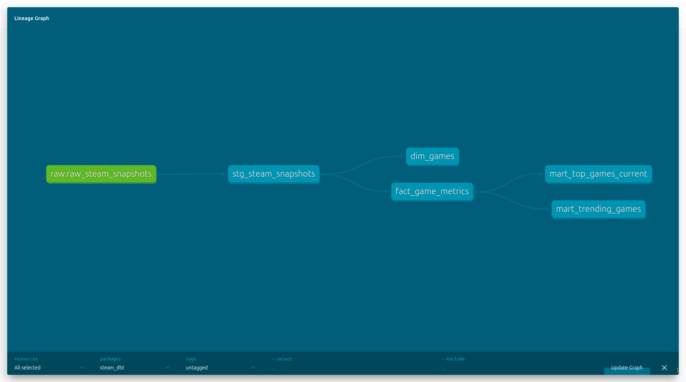
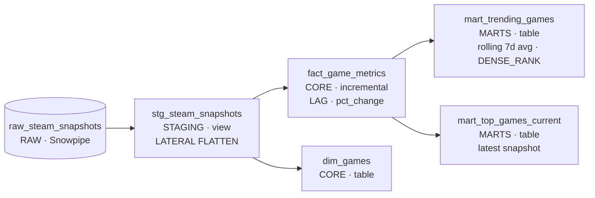
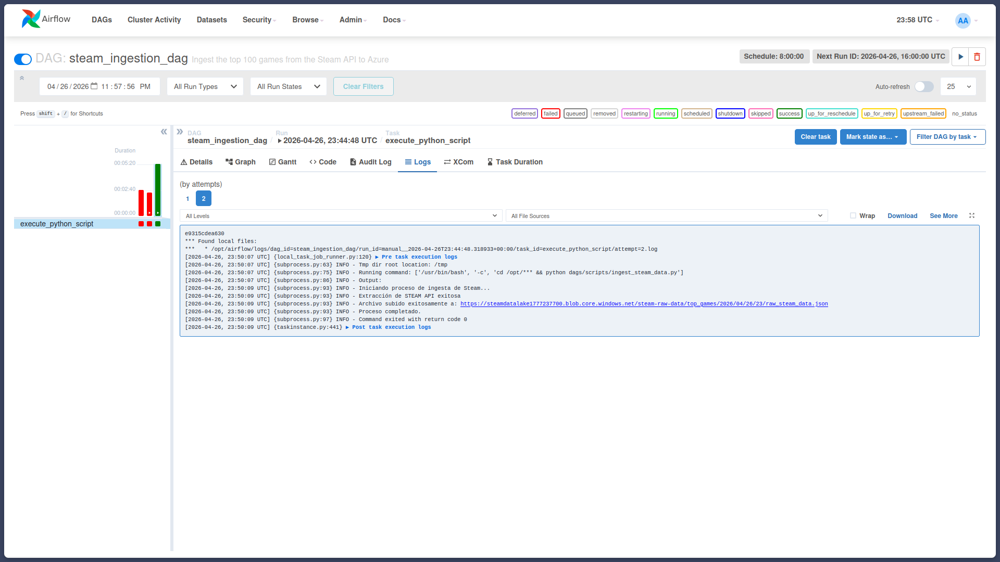

# Steam Analytics Platform

End-to-end data engineering pipeline that tracks Steam gaming trends in real time. Extracts concurrent player data from the Steam API every 8 hours, stores raw data in Azure Blob Storage, loads it automatically into Snowflake via Snowpipe, transforms it with dbt, and serves the results as a live dashboard.

**[→ Live Dashboard](https://www.davidra.dev/projects/steam)**

---

## Architecture

```
┌─────────────────────────────────────────────────────────────────┐
│                    GitHub Actions (cron: 0 */8 * * *)           │
└────────────────────────┬────────────────────────────────────────┘
                         │ Python · requests
                         ▼
                    Steam API
          ISteamChartsService/GetGamesByConcurrentPlayers
                         │ JSON
                         ▼
┌─────────────────────────────────────────────────────────────────┐
│              Azure Blob Storage  (Bronze / Raw)                 │
│     top_games / YYYY / MM / DD / HH / raw_steam_data.json      │
└────────────────────────┬────────────────────────────────────────┘
                         │ Azure Event Grid → Snowpipe (auto)
                         ▼
┌─────────────────────────────────────────────────────────────────┐
│                        Snowflake                                │
│                                                                 │
│  RAW        RAW_STEAM_SNAPSHOTS  (VARIANT column)              │
│               │                                                 │
│               │  LATERAL FLATTEN                                │
│               ▼                                                 │
│  STAGING    stg_steam_snapshots  (view)                        │
│               │                                                 │
│               ├──────────────────┐                             │
│               ▼                  ▼                             │
│  CORE       fact_game_metrics   dim_games                      │
│             (incremental)                                       │
│               │                                                 │
│               ├──────────────────┐                             │
│               ▼                  ▼                             │
│  MARTS      mart_trending_games  mart_top_games_current        │
└────────────────────────┬────────────────────────────────────────┘
                         │ export_to_json.py
                         ▼
┌─────────────────────────────────────────────────────────────────┐
│              Azure Blob Storage  (Public / Serving)             │
│     top_games_current.json  ·  trending_games.json             │
│     player_history.json                                         │
└────────────────────────┬────────────────────────────────────────┘
                         │ fetch()
                         ▼
                  React Dashboard
```

---

## dbt Lineage





---

## Tech Stack

| Layer | Tool | Purpose |
|---|---|---|
| Orchestration | GitHub Actions | Cron schedule every 8 hours |
| Extraction | Python · requests | Steam API ingestion |
| Data Lake | Azure Blob Storage | Raw JSON partitioned by `YYYY/MM/DD/HH` |
| Ingestion | Snowpipe + Azure Event Grid | Event-driven load on file arrival (~30s latency) |
| Warehouse | Snowflake | Analytical storage and compute |
| Transformation | dbt Core | SQL models, tests, documentation |
| Serving | Azure Blob Storage (public) | Static JSON for the dashboard |
| Dashboard | React · Chart.js | Live visualization |

---

## dbt Models

### Staging
- **`stg_steam_snapshots`** — Flattens raw JSON using `LATERAL FLATTEN`. One row per game per snapshot. Materialized as a view.

### Core
- **`fact_game_metrics`** — Incremental model. Stores the full time series of player counts per game. Uses `LAG()` window function to compute period-over-period changes and a custom `pct_change` macro.
- **`dim_games`** — Unique game catalogue built from all snapshots.

### Marts
- **`mart_trending_games`** — Ranks games by 7-snapshot rolling average growth using `AVG() OVER` and `DENSE_RANK()`.
- **`mart_top_games_current`** — Latest snapshot ranking with rank change and player count delta.

### Tests
18 data quality tests covering `not_null` and `unique` constraints across all layers.

---

## Pipeline Flow

```
Every 8 hours
    │
    ├─ [ingest job]
    │       Steam API → Python → Azure Blob (raw JSON)
    │
    └─ [transform job]  (runs after ingest succeeds)
            dbt run   → Snowflake models updated
            dbt test  → 18 data quality checks
            export_to_json.py → Public JSON refreshed
```

---

## Key Design Decisions

**Snowpipe over scheduled COPY INTO**
Event-driven ingestion decouples the extraction schedule from the load step. Files land in Snowflake within ~30 seconds of upload, regardless of pipeline timing.

**VARIANT column in RAW**
Storing the complete raw JSON preserves the original API payload. If Steam changes its schema, the ingestion layer never breaks — only the dbt models need updating.

**Incremental dbt model for `fact_game_metrics`**
Each pipeline run only processes new snapshots, keeping compute costs minimal regardless of how long the pipeline runs.

**Static JSON export instead of a backend**
Exporting processed data to public blob storage decouples the dashboard from Snowflake credentials entirely, eliminates the need to host a backend API, and keeps dashboard load time fast.

---

## Project Structure

```
├── .github/workflows/
│   └── steam_ingest.yml         # GitHub Actions pipeline
├── dags/scripts/
│   └── ingest_steam_data.py     # Steam API extraction
├── dbt/
│   ├── models/
│   │   ├── staging/             # stg_steam_snapshots + source freshness
│   │   ├── core/                # fact_game_metrics (incremental), dim_games
│   │   └── marts/               # mart_trending_games, mart_top_games_current
│   ├── macros/
│   │   └── pct_change.sql       # Reusable % change macro
│   └── profiles.yml             # Snowflake connection via env vars
├── scripts/
│   └── export_to_json.py        # Snowflake MARTS → public Azure Blob
└── docker-compose.yaml          # Local Airflow for development
```

---

## Local Development



The production schedule runs on GitHub Actions. For local development, Apache Airflow runs in Docker:

```bash
docker compose up -d
# Airflow UI → http://localhost:8080
```

dbt models run locally against Snowflake:

```bash
cd dbt
SNOWFLAKE_ACCOUNT=... SNOWFLAKE_USER=... SNOWFLAKE_PASSWORD=... \
dbt run --profiles-dir .
dbt test --profiles-dir .
dbt docs serve --port 8080   # lineage graph at localhost:8080
```
